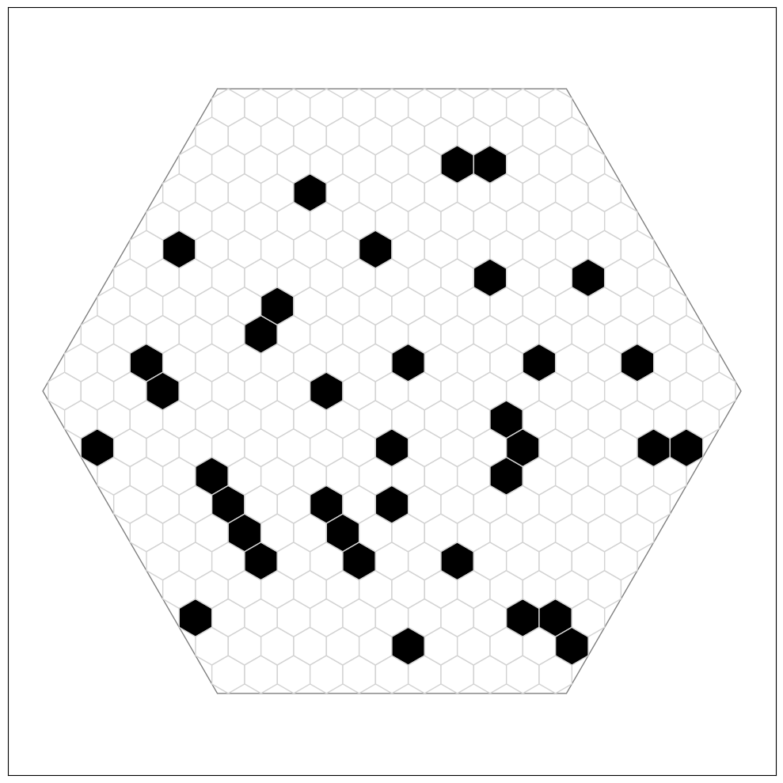

# The team
* Malcolm MacIver - Principal Investigator
* Daniel Dombeck - Principal Investigator
* German Espinosa - Posdoctoral Researchers
* Chris Angeloni - Posdoctoral Researchers
* Alex Lai - Ph.D. Student
* Gabrielle Wink - Ph.D. Student
* Lily Browdy - Undergrad Student
* Judith - Undergrad Student
* Ben - Undergrad Student
* Parker - Undergrad Student

# Public datasets
1. [Mus Musculus in mid entropy environment (21_05)](https://www.google.com)
2. 
3. 
4. 
5. 
6. 

# The cellworld Library
Use the cellworld library to generate new world configurations or open existing ones, explore experimental results, plot results and more.

## Prerequisites
Python 3.6 or newer.

## Installation
```shell
>> pip pinstall cellworld
```

## Examples

### Opening a world from the library
code:
```python
import cellworld as cw
import matplotlib.plyplot as plt
world = cw.World.get_from_parameters_names("hexagonal", "canonical", "21_05")
display = cw.Display(world)
plt.show()
```
result:

